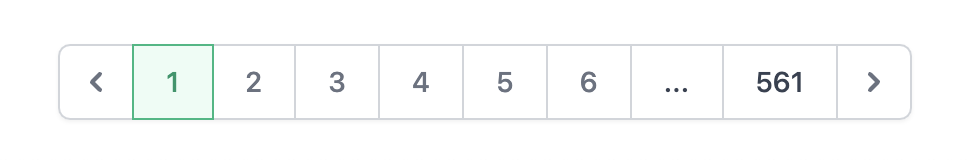

# paginator-django-tailwind
This repository is a Django paginator for the template of your Django project carried out with TailWind.

This is the result:



Your view need send "paginator" in the context. Example of your views.py:
```
def example_view(self):
    elements_list = Foo.objects.all().order_by('id')
    paginator = Paginator(elements_list, 25)
    page = request.GET.get('page')
    page_elements = paginator.get_page(page)
    context = {
        'paginator': paginator,
        'list': page_elements,
        }
    return render(request, 'app/list_with_paginator.html', context)
```
    
And you need import 'paginator.html' in your template "list_with_paginator.html":
```
<div class="flex justify-center">
    
</div>
```
